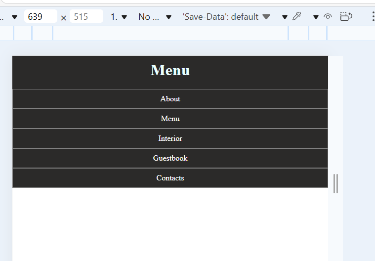
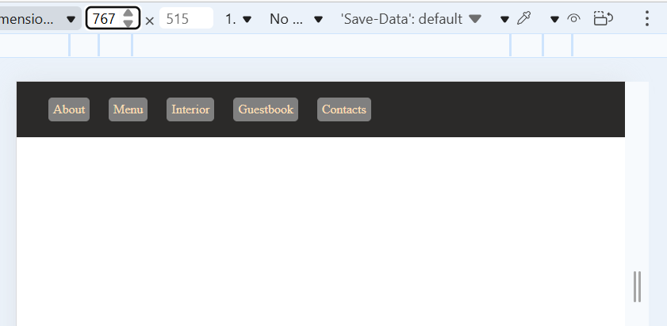
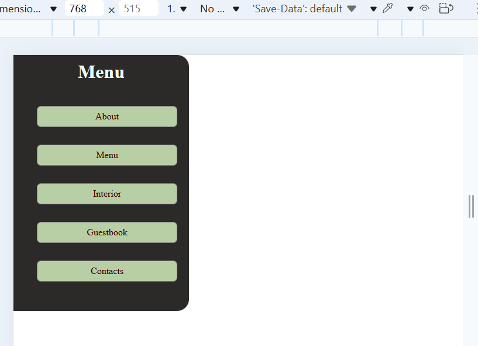

# Membuat Navigation Bar Responsive

contoh sederhana **Navigation Bar** menggunakan **HTML & CSS** tanpa menggunakan Flexbox.  
Dibuat **responsive** dengan**media query** untuk tampilan di berbagai ukuran layar.

---

## Fitur

Menggunakan **HTML semantic** (`header`, `nav`, `ul`, `li`)
Responsive layout dengan **media query**

menggunakan `block` & `inline-block`
Tampilan berbeda untuk:

- small 640 px
- medium 768 px
- large 1024 px

---

## Hasil Screenshoot







---

## Struktur HTML

```html
<header>
  <div class="title-menu">
    <h1>Menu</h1>
  </div>
  <nav class="nav">
    <ul class="nav-ul">
      <li class="nav-list">
        <a href="#">About</a>
      </li>
      <li class="nav-list">
        <a href="#">Menu</a>
      </li>
      <li class="nav-list">
        <a href="#">Interior</a>
      </li>
      <li class="nav-list">
        <a href="#">Guestbook</a>
      </li>
      <li class="nav-list">
        <a href="#">Contacts</a>
      </li>
    </ul>
  </nav>
</header>
```
